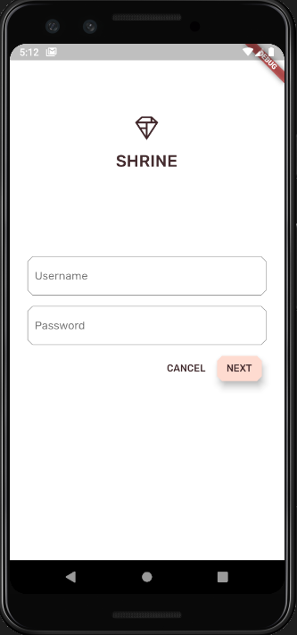
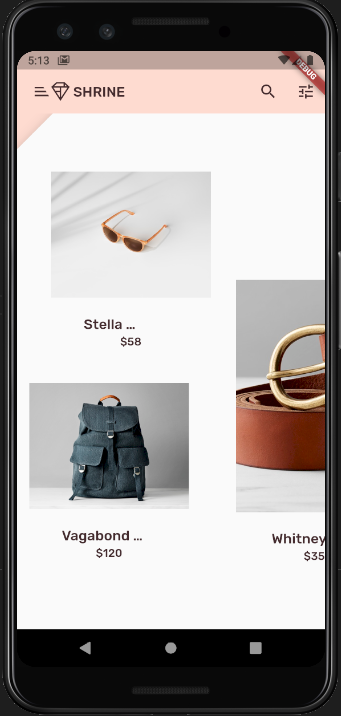
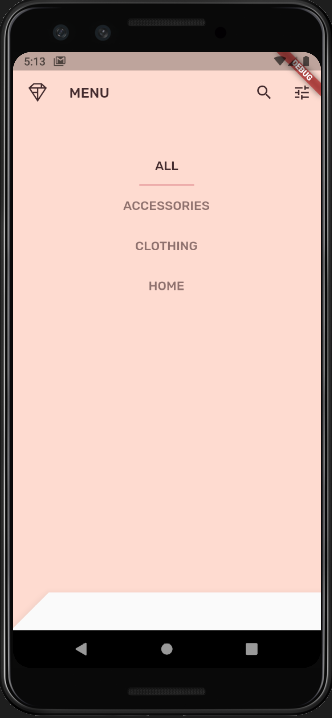

# ESS-Flutter-Codelabs
- [x] Write your first Flutter app, part 1
- [x] Write Your First Flutter App, part 2
- [x] MDC-101 Flutter: Material Components (MDC) Basics (Flutter)
- [x] MDC-102 Flutter: Material Structure and Layout (Flutter)
- [x] MDC-103 Flutter: Material Theming with Color, Shape, Elevation, and Type (Flutter)
- [x] MDC-104 Flutter: Material Advanced Components (Flutter)

### Flutter First Application

### Flutter Second Application
 | 

### Flutter Material Application
 
 |  | 
